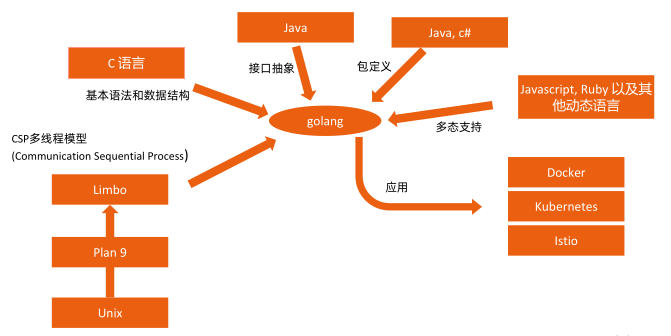
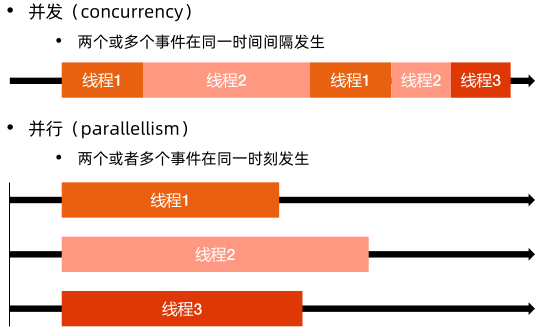

# go语言特性
Go 语言是一个可以编译高效，支持高并发的，面向垃圾回收的全新语言.

- 秒级完成大型程序的单节点编译。
- 依赖管理清晰。
- 不支持继承，程序员无需花费精力定义不同类型之间的关系。
- 支持垃圾回收，支持并发执行，支持多线程通讯。
- 对多核计算机支持友好。

Go 语言特性衍生来源:


## go语言环境变量
- GOROOT：go的安装目录
- GOPATH
    - src：存放源代码
    - pkg：存放依赖包
    - bin：存放可执行文件
- 其他常用变量
    - GOOS，GOARCH，GOPROXY
    - 国内用户建议设置goproxy：`export GOPROXY=https://goproxy.cn`

## go 基本命令

- `bug`:     start a bug report
- `build`:    compile packages and dependencies
- `clean`:    remove object files and cached files
- `doc`:    show documentation for package or symbol
- `env`:    print Go environment information
- `fix`:    update packages to use new APIs
- `fmt`:    gofmt (reformat) package sources
- `generate`:     generate Go files by processing source
- `get`:    add dependencies to current module and install them
- `install`:    compile and install packages and dependencies
- `list`:    list packages or modules
- `mod`:    module maintenance
- `run`:    compile and run Go program
- `test`:    test packages
- `tool`:    run specified go tool
- `version`: print Go version
- `vet`: report likely mistakes in packages

### go build
- Go 语言不支持动态链接，因此编译时会将所有依赖编译进同一个二进制文件。
- 指定输出目录。
    - `go build –o bin/mybinary .`
- 常用环境变量设置编译操作系统和 CPU 架构。
    - `GOOS=linux GOARCH=amd64 go build`
- 全支持列表。
    - `$GOROOT/src/go/build/syslist.go`
    
### go test
Go 原生自带测试

```go
import "testing"

func TestIncrease(t *testing.T) {
    t.Log("Start testing")
    increase(1, 2)
}
```
`go test ./.... -v` 运行测试
go test命令扫描所有*_test.go为结尾的文件，惯例是将测试代码与正式代码放在同目录，
如 foo.go 的测试代码一般写在 foo_test.go

### go vet
代码静态检查，发现可能的bug或者可以的构造。

- Print-format 错误，检查类型不匹配的print
```go
str := “hello world!”
fmt.Printf("%d\n", str)
```

- Boolen 错误， 检查一直为 true、false 或者冗余的表达式
`fmt.Println(i != 0 || i != 1)`

- Range 循环，比如如下代码主协程会先退出，go routine无法被执行
```go
words := []string{"foo", "bar", "baz"}
for _, word := range words {
    go func() {
       fmt.Println(word).
    }()
}
```

- Unreachable的代码，如 return 之后的代码

- 其他错误，比如变量自赋值，error 检查滞后等
```go
res, err := http.Get("https://www.spreadsheetdb.io/")
defer res.Body.Close()
if err != nil {
    log.Fatal(err)
}
```

## go 基础语法

### 控制结构

#### 分支控制

- `if`

```go
// 基本形式
if condition1 {
    // do something
} else if condition2 {
    // do something else
} else {
    // catch-all or default
}

// if 的简短语句
// 同 for 一样， if 语句可以在条件表达式前执行一个简单的语句。
if v := x - 100; v < 0{
    return v
}
```

- `switch`

    Go里面switch默认相当于每个case最后带有break，匹配成功后不会自动向下执行其他case，而是跳出整个switch, 但是可以使用fallthrough强制执行后面的case代码。

```go
switch var1 {
    case val1: //空分支
    case val2:
        fallthrough //执行case3中的f()
    case val3:
        f()
    default: //默认分支
        ...
}
```

#### 循环控制

Go 只有一种循环结构：for 循环。

- `for`

```go
// 计入计数器的循环
// for 初始化语句; 条件语句; 修饰语句 {}
for i := 0; i < 10; i++ {
    sum += i
}

// 初始化语句和后置语句是可选的，此场景与 while 等价（Go 语言不支持 while）
for ; sum < 1000; {
    sum += sum
}

// 无限循环
for {
    if condition1 {
        break
    }
}
```

- `for-range`

```go
// 遍历数组，切片，字符串，Map 等
for index, char := range myString {
    ...
}
for key, value := range MyMap {
    ...
}
for index, value := range MyArray {
...
}
// 需要注意：如果 for range 遍历指针数组，则 value 取出的指
// 针地址为原指针地址的拷贝
```

### 常用数据结构

#### 变量与常量

- 常量
    - 格式： `const identifier type`
    - 值后续无法改变

- 变量
    - 格式：`var identifier type`
    - 声明多个变量： `var c, python, java bool`
    - 声明时初始化：`var i, j int = 1, 2`
        - 若初始化值存在，则可省略类型，变量会从初始值中获得类型
        - `var i, j = 2, true`
    - 短变量声明：
        - 在函数中，简洁赋值语句 := 可在类型明确的地方代替 var 声明。
        - 函数外的每个语句都必须以关键字开始（var, func 等等），因此 := 结构不能在函数外使用。
        - `c, python, java := true, false, "no!"`
        
#### 类型转换与推导
- 类型转换
    - 表达式 T(v) 将值 v 转换为类型 T。
        - 数值转换：
        ```go
        var i int = 42
        var f float64 = float64(i)
        var u uint = uint(f)
        ```
        - 更简单形式：
        ```go
        i := 42
        f := float64(i)
        u := uint(f)
        ```
        
- 类型推导
    - 在声明一个变量而不指定其类型时（即使用不带类型的 := 语法或 var = 表达式语法），变量的类型由右值推导得出。
        - `var i int`
        - `j := i // j 也是一个 int`
        
#### 数组

- 相同类型且长度固定连续内存片段
- 以编号访问每个元素
- 定义方法：
     `var identifier [len]type`
- 示例：
    `myArray := [3]int{1,2,3}`
    
#### 切片

- 切片是对数组一个连续片段的引用
- 数组定义中不指定长度即为切片
- 切片在未初始化之前默认为`nil`， 长度为0

- 常用方法
```go
func main() {
    myArray := [5]int{1, 2, 3, 4, 5}
    mySlice := myArray[1:3]
    fmt.Printf("mySlice %+v\n", mySlice)
    fullSlice := myArray[:]
    remove3rdItem := deleteItem(fullSlice, 2)
    fmt.Printf("remove3rdItem %+v\n", remove3rdItem)
}
func deleteItem(slice []int, index int) []int {
        return append(slice[:index], slice[index+1:]...)
}
```

- make 和 new
    - `new`： 返回指针地址
    - `make`：返回第一个元素，可预设内存空间，避免未来的内存拷贝

- 切片常见问题
    - 切片动态扩展引发的问题
    ```go
    a:= []int //分配了内存空间1
    b:=[]int{1,2,3} //分配了内存空间2
    c:=a //c指向了内存空间1
    a=append(b,1) //若内存空间2已经用完，则会开辟新内存空间其内容为增加后的元素，
    //此时a会指向新开辟的内存空间3,导致c和a数据不同
    ```
    - 修改切片值问题
    ```go
    mySlice := []int{10, 20, 30, 40, 50}
    for _, value := range mySlice {
        value *= 2 //go都是值传递，此处的value为临时变量
    }
    fmt.Printf("mySlice %+v\n", mySlice)
    for index, _ := range mySlice {
        mySlice[index] *= 2 //正确做法为通过下标操作切片元素
    }
    fmt.Printf("mySlice %+v\n", mySlice)
    ```
    
#### map

- 声明方法： `var map1 map[keytype]valuetype`

- 示例：
```go
myMap:=make(map[string]string,10)
myMap["a"]="b"
myFuncMap:=map[string]func() int{
    "funcA":func() int {return 1},
}
fmt.Println(myFuncMap)
f:=myFuncMap["funcA"]
fmt.Println(f())
```

- 访问map元素
    - 按key取值
    ```go
    value, exists := myMap["a"]
    if exists {
        println(value)
    }
    ```
    - 遍历
    ```go
    for k,v := range myMap {
        println(k,v)
    }
    ```

#### 指针
- Go 语言支持指针，但不支持指针运算
- 指针变量的值为内存地址
- 未赋值的指针为 nil
    
```go
func printMyType(t *MyType){
    println(t.Name)
}
func main(){
    t := MyType{Name: "test"}
    printMyType(&t)
}
```

#### 结构体

- 声明方法：`type identifier struct`

- 示例
```go
type MyType struct {
    Name string
}
```

- 结构体标签
    - 结构体中的字段除了有名字和类型外，还可以有一个可选的标签（tag）
    - 使用场景：Kubernetes APIServer 对所有资源的定义都用 Json tag 和 protoBuff tag（序列化/反序列化）
    ```go
    type MyType struct {
        Name string `json:"name"`
    }
    func main(){
        mt:=MyType{Name:"test"}
        myType:=reflect.TypeOf(mt)
        name:=myType.Field(0)
        tag:=name.Tag.Get("json")
        println(tag)
    }
    ```
    
#### 类型别名 todo

### 函数

格式：
```
func function_name( [parameter list] ) [return_types] {
   函数体
}
```
-  func：函数由 func 开始声明
-   function_name：函数名称，参数列表和返回值类型构成了函数签名。
-   parameter list：参数列表，参数就像一个占位符，当函数被调用时，你可以将值传递给参数，这个值被称为实际参数。参数列表指定的是参数类型、顺序、及参数个数。参数是可选的，也就是说函数也可以不包含参数。
-  return_types：返回类型，函数返回一列值。return\_types 是该列值的数据类型。有些功能不需要返回值，这种情况下 return_types 不是必须的。
-   函数体：函数定义的代码集合。


#### main 函数

- 每个 Go 程序都应该有个 main package
- main package 里的 main 函数是 Go 语言程序入口

```go 
package main

func main() {
    args:=os.Arga
    if len(args)!=0{
        println("Do not accpet any argument")
        os.Exit(1)
    }
    printlin("Hello world")
}
```

- go 语言中 main 函数与其他语言不通，没有类似 java 的 []string args 参数
- go 语言传参方法
    - 方法1：
    `fmt.Println("os args is:", os.Args)`
    - 方法2：
    ```
    name:=flag.String("name", "world", "specify the name you want to say hi")
    flag.Parse()
    ```
    
#### init 函数

- init 函数:  在包初始化时运行
- 当多个依赖项目引用同一项目，且被引用项目的初始化在 init 中完成，并且不可重复运行时，会导致启动错误

```go
package main
var myVariable=0
func init(){
    myVariable = 1
}
```

#### 返回值
- 多返回值
    - 函数可以返回任意数量的返回值
- 命名返回值
    - go 返回值可被命名，它们会被视作定义在函数顶部的变量。
    - 返回值的名称应当具有一定的意义，它可以作为文档使用。
    - 没有参数的 return 语句返回已命名的返回值。也就是直接返回。
- 调用者可忽略部分返回值
`result,_=strconv.Atoi(origStr)`

#### 传递边长参数

go 中可变长参数允许调用方传递任意多个相同类型的参数

- 函数定义
`func append(slice []Type, elems ...Type)[]Type`

- 调用方法
```
myArray:=[]string{}
myArray=append(myArray,"a","b","c")
```

#### 内置函数

|       函数名       |             作用              |
| ----------------- | ----------------------------- |
| close             | 管道关闭                       |
| len, cap          | 返回数组、切片、map的长度或容量 |
| new, make         | 内存分配                       |
| copy,append       | 操作切片                       |
| panic,recover     | 错误处理                       |
| print,println     | 打印                          |
| complex,real,imag | 操作复数                       |

#### 回调函数（Callback）

函数作为参数传入其它函数，并在其他函数内部调用执行

- `strings.IndexFunc(line, unicode.IsSpace)`
- Kubernetes controller的leaderelection

```go
func main() {
    DoOperation(1, increase)
    DoOperation(1, decrease)
}
func increase(a, b int) {
    println(“increase result is:”, a+b) 
}
func DoOperation(y int, f func(int, int)) {
    f(y, 1) 
}
func decrease(a, b int) {
    println("decrease result is:", a-b)
}
```

#### 闭包
闭包是匿名函数

- 不能独立存在
- 可以赋值给其他变量：`x:=func(){}`
- 可以直接调用
    - `func(x,y int){println(x+y)}(1,2)`
- 可作为函数返回值
    - `func Add() (func(b int) int)`
    
```go
defer func(){
    if r:=recover();r!=nil{
        println("recocvered in FuncX")
    }
}()
```

#### 方法

方法就是一个包含了接受者的函数,

`func(recv receiver_type) methodName(parameter_list)(return_value_list)`

很多场景下，函数需要的上下文可以保存在receiver属性中，通过定义receiver的方法，该方法可以直接访问receiver属性，减少参数传递需求。

```go
// StartTLS starts TLS on a server fro NewUnstartedServer.
func (s *Server) StartTLS(){
    if s.URL!=""{
        panic("Server already started")
    }
    if s.client==nil{  
    s.cleint=&htt.Client{Transport: &http.Transport{}}
    }
}
```

#### 函数传参

- go 语言只有一种规则——传值
- 函数内修改参数的值不会影响函数外原始变量的值
- 可以传递指针参数将变量地址传递给调用函数，Go语言会复制该指针作为函数内的地址，但指向同一地址

#### 接口

- 接口定义一组方法合集
- 适用场景：Kubernetes 中有大量的接口抽象和多种实现
- Struct 无需显示声明实现 interface，只需直接实现方法
- Struct 除实现 interface 定义的接口外，还可以有额外的方法
- 一个类型可实现多个接口（Go 语言的多重继承）
- Go 语言中接口不接受属性定义
- 接口可以嵌套其他接口

```go
type IF interface{
    getName() string
}

type Human struct {
    firstName, lastName string
}

func (h *Human) getName() string {
    return h.firstName + "," + h.lastName
}

type Car struct {
    factory, model string
}

func (c *Car) getName() string {
    return c.factory + "-" + c.model
}

func main() {
    interfaces :[]IF{}
    h:=new(Human)
    h.firstName="first"
    h.lastName="last"
    interfaces=append(interfaces,h)
    c:=new(Car)
    c.factory="benz"
    c.model="s"
    interfaces=append(interfaces,c)
    for _,f:= range interfaces {
        fmt.Println(f.getName())
    }
}
```

- **注意事项**
    - Interface 可能为 nil, 针对 interface 的使用一定要预先判空， 否则会引起程序漰溃（nil panic）
    - Struct 初始化意味着空间分配，对struct的引用不会出现空指针
    

#### 反射

- `reflect.TypeOf()` 返回检查对象的类型
- `reflect.ValueOf()`返回检查对象的值

```
myMap:=make(map[string]string, 10)
myMap["a"]="b"
t:reflect.TypeOf(myMap)
fmt.Println("type:", t)
v:=reflect.ValueOf(myMap)
fmt.Println("value:", v)

// struct
myStruct:=T{A:"a"}
v1:=reflect.ValueOf(myStruct)
for i:=0;i<v1.NumField();i++{
    fmt.Printf("Field %d: %v\n",i,v1.Field(i))
}
for i:=0;i<v1.NumMethod();i++{
    fmt.Printf("Method %d: %v\n",i,v1.Method(i))
}

// 需要注意 receive 是 struct 还是指针
result:=v1.Method(0).Call(nil)

fmt.Println("Result:", result)
```

#### 面向对象编程

- 可见性控制
    - public —— 常量、变量、类型、接口、接口、函数等的名称大些
    - privat —— 非大写只能在包内使用
- 继承
    - 通过组合实现，内嵌一个或多个 struct
- 多态
    - 通过接口实现，通过接口定义方法集，编写多套实现
    
#### Json 编解码

- `Unmarshal`：从 string 转换 struct

```go
func unmarshal2Structl (humanStr string) Human{
    h:=Human{}
    err:=json.Unmarshal([]byte(humanStr),&h)
    if err!=nil{
        println(err)
    }
    return h
}
```

- `Marshal`：从 struct 转换 string

```go
func marshal2JsonString(h Human) string{
    h.Age=30
    updatedBytes, err:=json.Marshal(&h)
    if err !=nil {
        println(err)
    }
    return string(updatedBytes)
}
```

- json 包使用 `map[string]interface{}` 和 `[]interface{}` 类型保存任意对象

```go
var obj interface{}
err:=json.Unmarshal([]byte(humanStr),&obj)
objMap,ok:obj.(map[string]interface{})
for k,v:= range objMap{
    switch value:=v.(type){
        case string:
            fmt.Printf("type of %s is string, value is %v\n", k, value)
        case interface{}:
            fmt.Printf("type of %s is interface{}, value is %v\n", k, value)
        default:
            fmt.Printf("type of %s is wrong, value is %v\n", k, value)
    }
}
```

### 常用语法

#### 错误处理

- go 语言无内置 exception 机制，只提供 error 接口供定义错误
```go
type error interface {
    Error() string
}
```

- 通过 `errors.New` 或者 `fmt.Errorf` 创建新的 error
`var errNotFounderror=errors.New("NotFound")`

- 通常应用程序对 error 的处理大部分是判断 error 是否为 nil

如需将 error 归类，通常交给应用程序自定义，比如 kubernetes 自定义了与 apiserver 交互的不同类型错误

```go
type StatusError struct {
    ErrStatus metav1.Status
}
var _ error = &StatusError{}
// Error implements the Error interface.
func (e *StatusError) Error() string {
    return e.ErrStatus.Message
}
```

#### defer

- 函数返回之前执行某个语句或函数
    - 等同于 Java 和 C# 的 finally
- 常见的 defer 使用场景：记得关闭你打开的资源
    - `defer file.Close()`
    - `defer mu.Unlock()`
    - `defer println("")`
    
- 注意 defer 是函数级别的关键字，在函数退出时执行

#### panic 和 recover
- `panic`： 可在系统出现不可恢复错误时主动调用panic, panic会使当前线程直接crash
- `defer`： 保证执行并把控制权交还给接收到panic的函数调用者
- `recover`：函数从panic或者错误场景中恢复

```go
defer func() {
    fmt.Println("defer func is called")
    if err := recover(); err != nil{
        fmt.Println(err)
    }
}()
panic("a panic is triggered")
```

### 多线程

#### 并发和并行



#### 协程

- 进程
    - 分配系统资源（CPU时间、内存等）基本单位
    - 有独立的内存空间，切换开销大
- 线程：进程的一个执行流，是CPU调度并能独立运行的基本单位
    - 同一进程中的多线程共享内存，线程切换代价小
    - 多线程通信方便
    - 从内核层面来看线程也是一种特殊进程，与父进程共享打开的文件和文件系统信息，共享地址空间和信号处理函数
- 协程
    - go语言中的清量线程实现
    - glang 在 runtime、系统调用等多方面对goroutine调度进行了分装和处理，当遇到长时间执行或者进行系统调用时，会主动把当前 goroutine 的 CPU 转让出去，让其他 goroutine 能被调度并执行，也就是 Golang 从语言层面支持了协程。
    

#### CSP（Communicating Sequential Process）

- CSP
    - 描述两个独立的并发实体通过共享的通讯 channel 进行通信的并发模型。
- Go 协程 goroutine
    - 是一种轻量线程，它不是操作系统的线程，而是将一个操作系统线程分段使用，通过调度器实现协作式调度。
    - 是一种绿色线程，微线程，它与 Coroutine 协程也有区别，能够在发现堵塞后启动新的微线程。
- 通道 channel
    - 类似 Unix 的 Pipe，用于协程之间通讯和同步。协程之间虽然解耦，但是它们和 Channel 有着耦合。
    
#### 协程和协程的差异

- 每个goroutine (协程) 默认占用内存远比 Java 、C 的线程少
    - goroutine：2KB
    - 线程：8MB
- 线程 goroutine 切换开销方面，goroutine 远比线程小
    - 线程：涉及模式切换(从用户态切换到内核态)、16个寄存器、PC、SP...等寄存器的刷新
    - goroutine：只有三个寄存器的值修改 - PC / SP / DX.
- GOMAXPROCS
    - 控制并行线程数量
    
#### 协程示例

```go
for i:=0;i<10;i++{
    go fmt.Println(i)
}
time.Sleep(time.Second)
```

#### channel -- 多线程通信

- Channel 是多个协程之间通讯的管道
    - 一端发送数据，一端接收数据
    - 同一时间只有一个协程可以访问数据，无共享内存模式可能出现内存竞争
    - 协调协程的执行顺序
- 声明方式
    - `var identifier chan datatype`
    - 操作符`<-`
    
```go
ch := make(chan int)
go func() {
    fmt.Println("hello from goroutine")
    ch <- 0 //数据写入Channel
}()
i := <- ch //从Channel中数据并赋值
```

#### 通道缓冲

- 基于 Channel 的通信是同步的
- 当缓冲区满时，数据的发送是阻塞的
- 通过 make 关键字创建通道时可以定义缓冲区容量，默认缓冲区容量为0

#### 便利通道缓冲区

```go
ch := make(chan int, 10)
go func() {
    for i:=0;i<10;i++{
        rand.Seed(time.Now().UnixNano())
        n:=rand.lntn(10) // n will be between 0 and 10
        fmt.Print("putting:",n)
        ch<-n
    }
    close(ch)
}()
fmt.Println("hello from main")
for v:=range ch {
    fmt.Println("receiving:",v)
}
```

#### 单向通道
- 只发送通道：`var sendOnly chan<- int`
- 只接收通道：`var readOnly <-chan int`

- Istio webhook controller
```go
func (w *WebhookCertPatcher) runWebhookController(stopChan <-chan struct[]){}
```

- 使用：双向通道转换
```go
var c=make(chan int)
go prod(c)
go consume(c)
func prod(ch chan<- int){
    for { ch <- 1}
}
func consume(ch <-chan int){
    for {<-ch}
}
```

#### 关闭通道
- 通道无需每次关闭
- 关闭的作用是告诉接收者该通道再无新数据发送
- 只有发送方需要关闭通道

```go
ch := make(chan int)
defer close(ch)
if v,notClosed:=<-ch;notClosed{
    fmt.Println(v)
}
```

#### select

- 当多个协程同时运行时，可通过 select 轮询多个通道
    - 如果所有的通道都阻塞则等待，如定义了 default 则执行 default
    - 如多个通道就绪则随即选择
    
```go
select {
    case v:= <-ch1:
        ...
    case v:= <-ch2:
        ...
    default:
        ...
}
```

#### 定时器 Timer

- time.Ticker 以指定的时间间隔重复向通道 C  发送时间值
- 使用场景： 为协程设定超时时间

```go
timer:=time.NewTimer(time.Second)
select{
    // check normal channel
    case <-ch:
        fmt.Println("received from ch")
    case <-timer.C:
        fmt.Println("timeout waiting from channel ch")
}
```

#### 上下文 Context

- 超时、取消操作或者一些异常情况，往往需要进行抢占操作或者中断后续操作
- Context 是设置截至日期、同步信号，传递请求相关值的结构体

```go
type Context interface{
    Deadline() (deadline time.Time, ok book)
    Done() <-chan struct{}
    Err() error
    Valeu(Key interface{}) interface{}
}
```

- 用法：
    - context.Background
        - Background 通常被用于主函数、初始化以及测试中，作为一个顶层的 context, 也就是说一般我们常见的 context 都是基于 Background
    - context.TODO
        - TODO 是在不确定使用什么 context 的时候才会使用
    - context.WithDeadline
        - 超时时间
    - context.WithValue
        - 向 context 添加键值对
    - context.WithCanel
        - 创建一个可取消的 context
        
#### 停止一个子协程

- 基于channel
```
done := make(chan bool)
go func() {
    for {
        select {
            case <-done:
                fmt.Println("done channel is triggerred, exit child go routine")
                return
        }
    }
}()
close(done)
```

- 基于 Context 
```go
// Context 是 Go 语言对 go routine 和timer的封装
ctx,cancel := context.WithTimeout(context.Background(), time.Second)
defer cancel()
go process(ctx, 100*time.Millisecond)
<-ctx.Done()
fmt.Println("main:", ctx.Err())
```